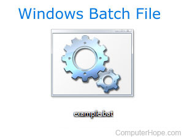

# Windows Batch Files Documentation :book:
## Overview :dart:
---

| Developer | Action |
| ----------- | ----------- |
| Miguel Estrada Murillo | Description of what Batch Files are and how Powershell can be used. |

    The following documentation is a brief summarry upon what can be done with the Powershell and Batch files.

Before starting:

**Windows Batch Files** are used for the following:.

- [x] Doing a disk partition
- [x] Using the GRUB
- [x] Selecting a primary operating system

Even though **PowerShell** and **Batch** are different languages, both can be integrated into each other and helps to call and execute each other tasks