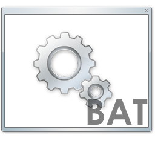

# Poweshell usage | Example :paperclip:

## Let's see how it works :hammer:

**Windows Batch Files** for *Windows system automation* and *Automation of different processes execution*.

---

| Developer | Action |
| ----------- | ----------- |
| Miguel Estrada Murillo | Windows Batch Files Quick Overview|

    From CMD commands to running different languages, tests or applications in a single click. 
    The following example, is to demonstrate how Powershell and Batch Files can be used.

**Before starting...** I will explain different ways from which a Windows Batch File can be executed from **Powershell**

---
## Example :mag:
---

### **From Powershell directly**

Step by step guide:
1. Run the following command on Powershell under **admin** priviliges: `Start-Process -FilePath “BatchFilePath”`

### **From Graphical Interface**

How to reach:

`Start > Windows Powershell`

*Once logged* inside Powershell, please repeat the upper mentioned process.

### **From CMD** 

#### **How to call CMD from the Powershell Console:**

How to reach:

`Start > CMD`

or

`Start-Process -FilePath cmd.exe`

#### **To call PowerShell from the cmd just type PowerShell.exe as shown below**

`PowerShell.exe`

Step by step guide:
1. Run the following command on Powershell under **admin** priviliges: `Start-Process -FilePath “BatchFilePath”`
